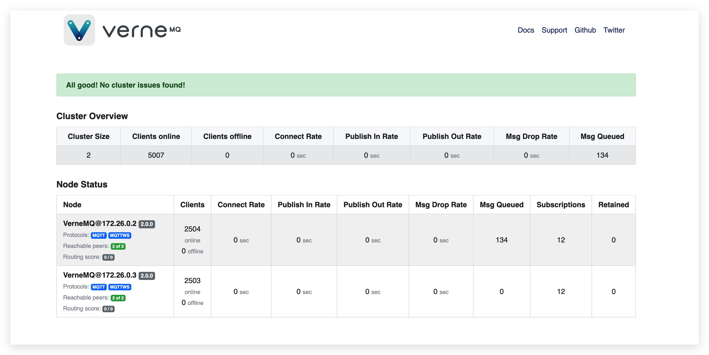
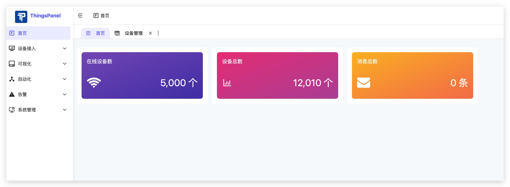
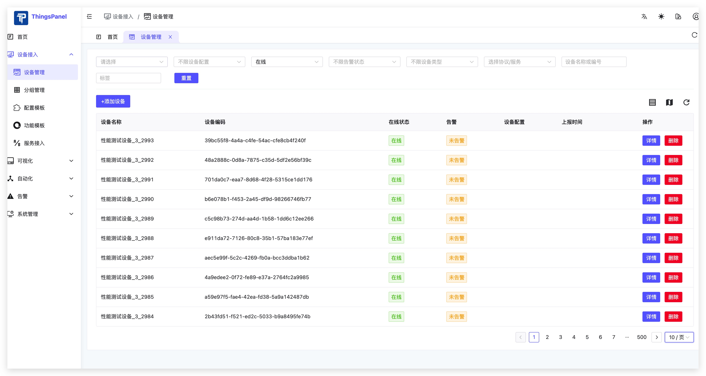
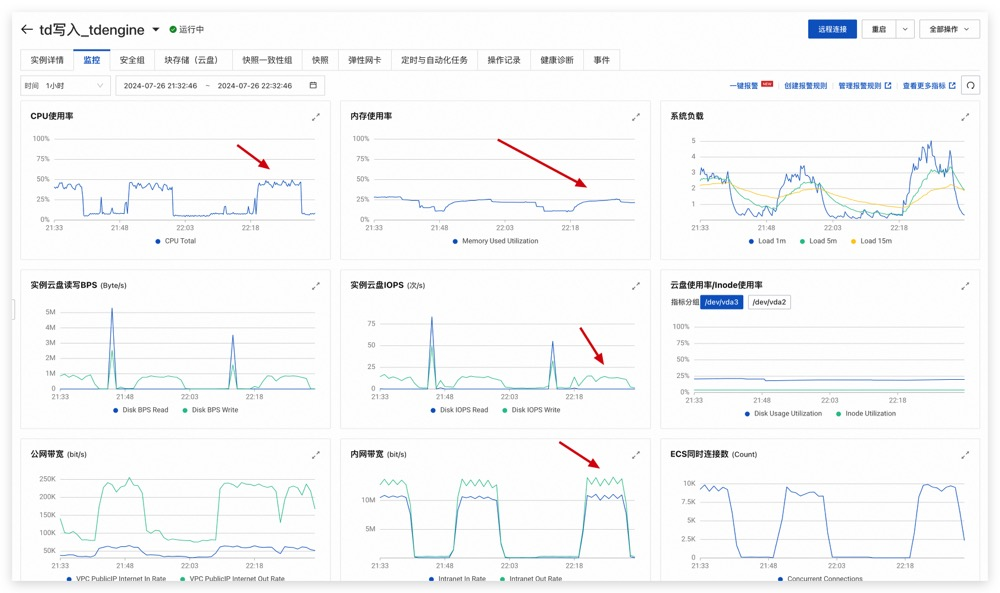
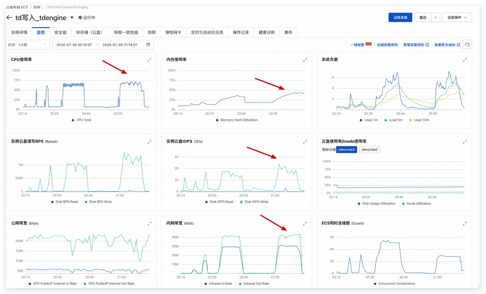

---

### 测试报告：ThingsPanel物联网平台性能评估

---

**测试背景**

为确保物联网平台满足不断增长的设备连接需求，并能够实时、准确地传输数据，我们进行了一系列性能测试。

---

**测试环境**

- **服务器配置**：共计3台服务器，每台配置为4核8G。
    | 机型 | CPU | 内存 | 硬盘 | 说明 |
    |:-------|:-------|:--------------|:--------------|:------------------------------------------
    | 阿里云 ecs.e-c1m2.xlarge    | 4核(vCPU) | 8G | 40GiB (2120 IOPS) | nginx、vernemq节点1、vernemq-webhook鉴权| 
    | 阿里云 ecs.e-c1m2.xlarge    | 4核(vCPU) | 8G | 40GiB (2120 IOPS) | 两个Things-TDengine、vernemq节点2、vernemq-webhook鉴权 |  
    | 阿里云 ecs.e-c1m2.xlarge    | 4核(vCPU) | 8G | 40GiB (2120 IOPS) | TDengine单节点数据库、redis、 thingspanel-backend-community-go:1.0.2、模拟客户端服务 |  

- **数据库部署**：TDengine单节点数据库一台服务器上。
- **入库程序部署**：Things-TDengine双服务写入TDengine。
- **设备数量**：5000台设备进行测试。
- **数据频率**：每台设备分别推送15000、75000个数据点,均持续10分钟

---

**测试结果**

| 场景 | IOPS | CPU使用率（%） | 内存使用率（%） | 内网带宽 |
|:-------|:-------|:--------------|:--------------|:-------
| 场景A     | 27  | 50 | 26 | 15M  | 
| 场景B    | 23 | 70 | 32 | 41M |  

---

**Things-TDengine入库性能**

***场景A***
- 5000台设备；
- 10分钟内上报5000个消息，每个消息包括3个数据点；
- TDengine单节点数据库（4核8G）
- 双服务入库（每个配置4核8G）
测试执行相关的统计信息
    
mq在线数

    
界面显示在线数

    
mq在线详情

    
监控

---
***场景B***
- 5000台设备；
- 10分钟内上报5000个消息，每个消息包括15个数据点；
- TDengine单节点数据库（4核8G）
- 双服务入库（每个配置4核8G）
测试执行相关的统计信息
    
mq在线数

    
mq在线详情

    
界面显示在线数

    
监控
